# 个人主页系统设计文档

## 项目概述

### 项目定位
个人主页系统（ppage）是一个纯前端部署的静态站点生成系统，专注于为学术研究者、开发者等个人用户提供一个零成本、易维护的在线主页解决方案。

### 核心价值
- **零基础设施成本**：无需服务器、数据库，完全依托 GitHub Pages 等静态托管服务
- **配置即内容**：通过 YAML 配置文件一站式管理个人信息、项目列表、主题样式
- **Markdown 驱动**：内容创作使用 Markdown，自动渲染为交互式响应式网页
- **学术友好**：原生支持 PDF 预览和多格式文件下载

### 技术选型总览

| 技术领域 | 选型方案 | 选择理由 |
|---------|---------|---------|
| 前端框架 | React 18 + Vite | 快速构建、现代化开发体验、生态成熟 |
| Markdown 渲染 | markdown-it | 轻量、插件生态丰富、可扩展性强 |
| 配置格式 | YAML | 人类可读性好、层级结构清晰 |
| 主题系统 | CSS 变量 | 运行时切换、体积小、易维护 |
| 样式方案 | CSS Modules + 响应式设计 | 样式隔离、设备自适应 |
| 构建部署 | Vite 构建 + GitHub Actions + 本地脚本 | 灵活性与自动化兼顾 |

---

## 系统架构设计

### 整体架构

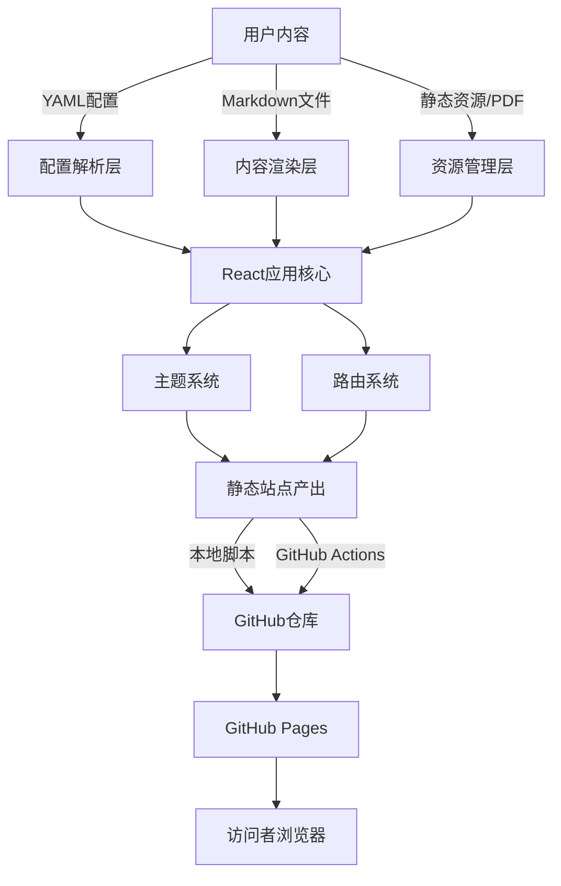

### 分层设计

#### 配置层（Configuration Layer）
负责解析和管理用户配置信息，提供统一的配置访问接口。

**职责范围**：
- 读取和解析 YAML 配置文件
- 验证配置结构和必填字段
- 提供配置项的类型安全访问
- 支持配置热重载（开发环境）

**配置文件结构**：

| 配置分类 | 配置项示例 | 说明 |
|---------|-----------|------|
| 个人信息 | name, avatar, bio, contacts | 基础个人资料 |
| 主题配置 | defaultTheme, themes | 主题列表和默认主题 |
| 导航结构 | navigation | 页面导航菜单 |
| 内容源 | contentPath, assetsPath | Markdown 和资源文件路径 |
| 社交链接 | social | GitHub、邮箱等联系方式 |
| 部署配置 | baseUrl, repository | 部署相关参数 |

#### 内容层（Content Layer）
处理 Markdown 文档的解析、渲染和增强功能。

**核心能力**：
- Markdown 转 HTML 渲染
- 代码高亮支持
- 数学公式渲染（可选插件）
- 自动生成目录
- 锚点链接生成
- 图片懒加载和优化

**Markdown 增强插件**：

| 插件功能 | 实现方式 | 应用场景 |
|---------|---------|---------|
| 代码高亮 | markdown-it-highlightjs | 技术博客、代码示例 |
| 表格支持 | markdown-it-table | 数据展示 |
| 任务列表 | markdown-it-task-lists | 项目进度展示 |
| 锚点链接 | markdown-it-anchor | 长文档导航 |
| 目录生成 | 基于标题层级自动生成 | 文档结构化展示 |

#### 展示层（Presentation Layer）
基于 React 组件构建的用户界面层。

**组件体系**：

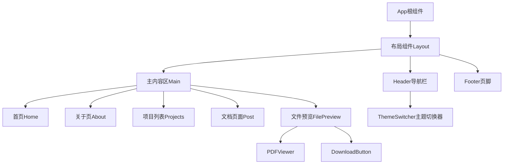

#### 资源层（Asset Layer）
管理静态资源的存储、访问和优化。

**资源分类**：
- 图片资源（头像、配图）
- PDF 文档
- 可下载文件（论文、简历等）
- 主题资源（图标、背景）

---

## 核心功能设计

### 功能一：配置驱动的内容管理

**设计目标**：用户只需编辑一个 YAML 配置文件，即可完成个人信息、导航、主题等所有设置。

**配置文件示例结构**（概念层级）：

```
站点配置
├── 基本信息（站点名称、描述、作者）
├── 个人资料（头像、简介、联系方式）
├── 主题设置（默认主题、可用主题列表）
├── 导航菜单（首页、关于、项目、博客等）
├── 内容路径（Markdown 文件目录、资源目录）
└── 社交链接（GitHub、邮箱、Twitter 等）
```

**配置加载流程**：

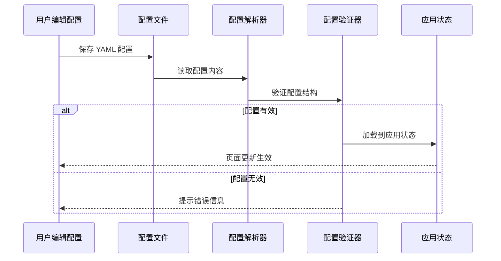

### 功能二：Markdown 内容渲染

**设计目标**：用户书写 Markdown 文件，系统自动渲染为美观的、可交互的网页。

**渲染流程**：


**特性支持矩阵**：

| Markdown 特性 | 支持程度 | 渲染效果 |
|--------------|---------|---------|
| 标题 H1-H6 | 完全支持 | 自动生成目录锚点 |
| 列表（有序/无序） | 完全支持 | 样式主题化 |
| 代码块 | 完全支持 | 语法高亮 + 语言标识 |
| 表格 | 完全支持 | 响应式滚动 |
| 图片 | 完全支持 | 懒加载 + 点击放大 |
| 链接 | 完全支持 | 外链标识 |
| 引用块 | 完全支持 | 样式美化 |
| 任务列表 | 插件支持 | 复选框渲染 |

**响应式适配策略**：

| 设备类型 | 断点范围 | 适配重点 |
|---------|---------|---------|
| 移动端 | < 768px | 单列布局、大字体、触摸友好 |
| 平板 | 768px - 1024px | 双列布局、侧边栏可折叠 |
| 桌面 | > 1024px | 多列布局、固定侧边栏、悬浮目录 |

### 功能三：多主题系统

**设计目标**：提供多套预设主题，用户可一键切换，主题通过 CSS 变量实现，支持运行时动态切换。

**主题架构**：

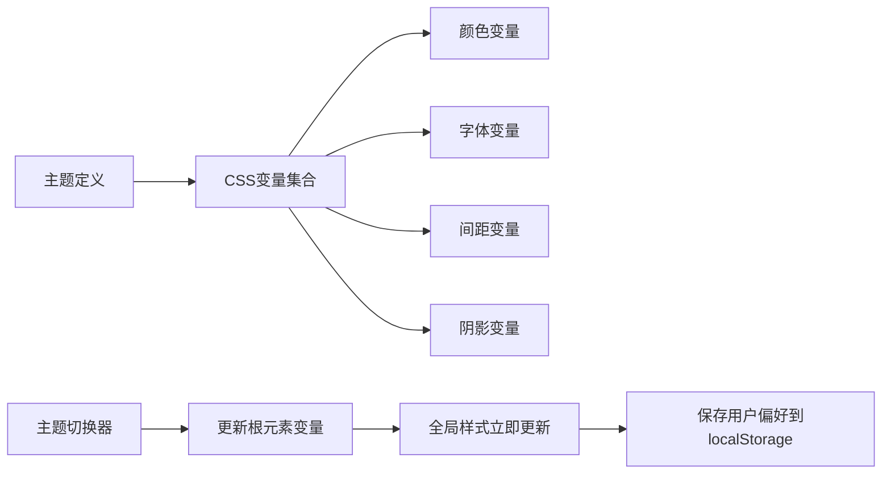

**主题变量设计**：

| 变量类别 | 变量示例 | 作用范围 |
|---------|---------|---------|
| 主色系 | primary-color, primary-hover | 按钮、链接、强调元素 |
| 背景色系 | bg-primary, bg-secondary | 页面背景、卡片背景 |
| 文字色系 | text-primary, text-secondary | 正文、辅助文字 |
| 边框色系 | border-color, divider-color | 分割线、边框 |
| 字体设置 | font-family-base, font-size-base | 全局字体 |
| 圆角 | border-radius-sm/md/lg | 组件圆角 |
| 阴影 | shadow-sm/md/lg | 卡片、弹窗阴影 |

**预设主题列表**：

| 主题名称 | 风格定位 | 适用场景 |
|---------|---------|---------|
| Light（明亮） | 白色背景、深色文字 | 日间阅读、通用场景 |
| Dark（暗黑） | 深色背景、浅色文字 | 夜间阅读、护眼 |
| Academic（学术） | 简约、专业、对比度高 | 学术展示、论文页面 |
| Colorful（多彩） | 渐变色、活泼 | 创意展示、作品集 |

**主题切换流程**：

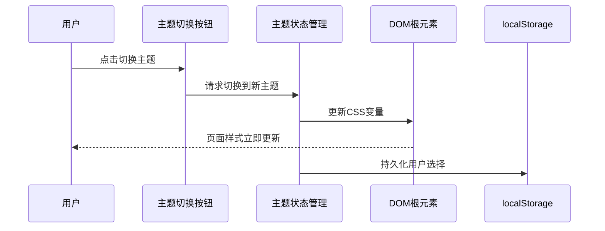

### 功能四：PDF 和文件管理

**设计目标**：支持 PDF 在线预览和各类文件的直接下载。

**文件处理策略**：

| 文件类型 | 处理方式 | 用户体验 |
|---------|---------|---------|
| PDF | 浏览器内嵌预览 | 通过 iframe 或专用 PDF 查看器组件 |
| 图片 | 直接展示 + 灯箱放大 | 点击图片全屏查看 |
| 文档（Word/Excel等） | 提供下载链接 | 点击直接下载 |
| 压缩包 | 提供下载链接 | 显示文件大小和描述 |

**PDF 预览组件设计**：

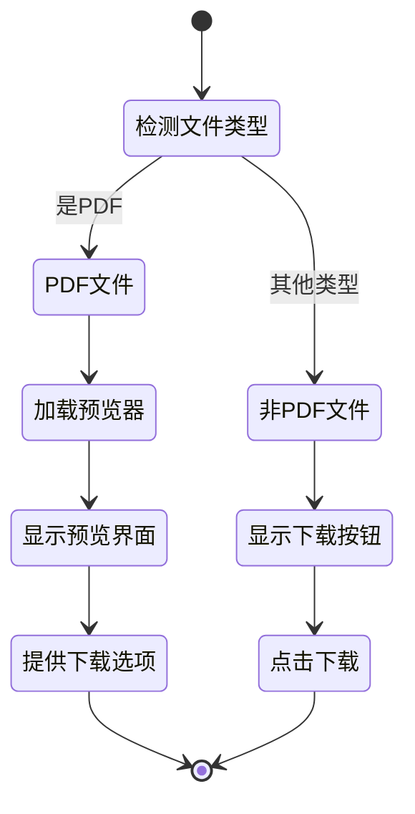

**文件组织方式**：

在配置文件中定义文件列表，每个文件包含以下属性：

| 属性名 | 类型 | 说明 |
|-------|------|------|
| title | 文本 | 文件显示名称 |
| description | 文本 | 文件描述 |
| type | 枚举 | pdf / document / archive / other |
| path | 路径 | 文件相对路径 |
| size | 文本 | 文件大小（可选） |
| preview | 布尔 | 是否支持预览 |

### 功能五：构建与部署自动化

**设计目标**：提供本地命令脚本和 GitHub Actions 两种部署方式，满足不同使用场景。

**构建流程**：

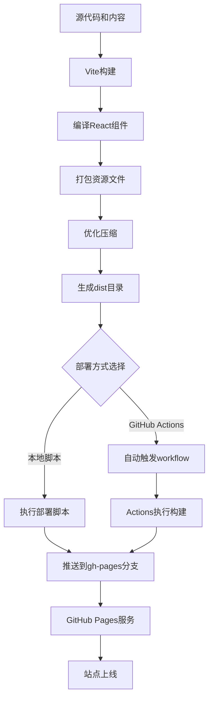

**本地部署脚本功能**：

| 功能 | 实现方式 | 用户操作 |
|------|---------|---------|
| 构建站点 | 调用 Vite 构建命令 | 运行部署脚本 |
| 提交产出 | 将 dist 内容提交到指定分支 | 自动执行 |
| 推送远程 | 推送到 GitHub 仓库 | 自动执行 |
| 触发部署 | GitHub Pages 自动检测更新 | 自动执行 |

**GitHub Actions 工作流**：

触发条件：
- 推送到主分支
- 手动触发（workflow_dispatch）

执行步骤：
1. 检出代码
2. 安装依赖
3. 执行构建
4. 部署到 GitHub Pages

**部署配置项**：

| 配置项 | 作用 | 配置位置 |
|-------|------|---------|
| baseUrl | 站点基础路径 | YAML 配置文件 |
| repository | 目标仓库地址 | YAML 配置文件 |
| branch | 部署分支名称 | 脚本参数或 Actions 配置 |
| buildCommand | 构建命令 | package.json |

---

## 目录结构设计

系统采用清晰的分层目录结构，便于维护和扩展：

```
ppage/
├── public/                     # 静态资源目录
│   ├── assets/                 # 用户资源
│   │   ├── images/             # 图片资源
│   │   ├── files/              # 可下载文件
│   │   └── pdfs/               # PDF文档
│   └── favicon.ico             # 站点图标
│
├── content/                    # 内容目录
│   ├── posts/                  # Markdown文章
│   └── pages/                  # Markdown页面
│
├── src/                        # 源代码目录
│   ├── components/             # React组件
│   │   ├── layout/             # 布局组件
│   │   ├── markdown/           # Markdown渲染组件
│   │   ├── theme/              # 主题相关组件
│   │   └── common/             # 通用组件
│   │
│   ├── config/                 # 配置处理
│   │   ├── parser.js           # YAML解析器
│   │   └── validator.js        # 配置验证器
│   │
│   ├── themes/                 # 主题定义
│   │   ├── light.css           # 明亮主题
│   │   ├── dark.css            # 暗黑主题
│   │   └── academic.css        # 学术主题
│   │
│   ├── utils/                  # 工具函数
│   │   ├── markdown.js         # Markdown处理工具
│   │   └── responsive.js       # 响应式工具
│   │
│   ├── App.jsx                 # 应用根组件
│   └── main.jsx                # 应用入口
│
├── scripts/                    # 部署脚本
│   └── deploy.sh               # 本地部署脚本
│
├── .github/                    # GitHub配置
│   └── workflows/              # Actions工作流
│       └── deploy.yml          # 部署工作流
│
├── config.yml                  # 用户配置文件
├── package.json                # 项目依赖
├── vite.config.js              # Vite配置
└── readme.md                   # 项目说明
```

---

## 数据流设计

### 配置数据流

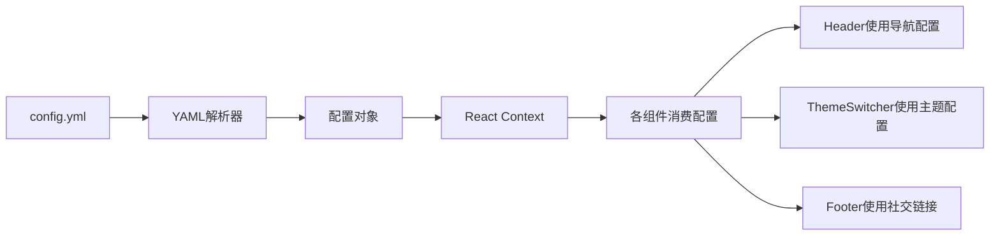

### 内容渲染数据流

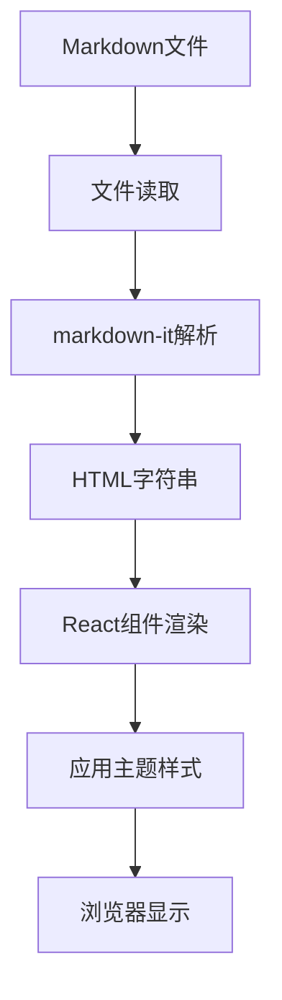

### 主题切换数据流

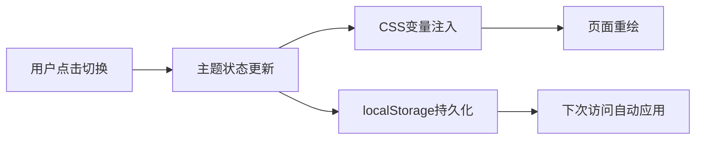

---

## 响应式设计策略

### 布局适配规则

| 屏幕宽度 | 布局模式 | 关键调整 |
|---------|---------|---------|
| < 768px | 单列垂直布局 | 侧边栏折叠为抽屉、导航变汉堡菜单 |
| 768px - 1024px | 混合布局 | 主内容区固定宽度、侧边栏可切换 |
| > 1024px | 多列布局 | 侧边栏固定、目录悬浮、宽屏优化 |

### 交互适配

| 设备类型 | 交互方式 | 设计考虑 |
|---------|---------|---------|
| 触摸设备 | 手势操作 | 按钮最小44x44px、滑动切换主题 |
| 鼠标设备 | 点击和悬停 | hover效果、右键菜单（可选） |

### 字体缩放

| 元素类型 | 移动端 | 平板 | 桌面 |
|---------|-------|------|------|
| 正文 | 16px | 17px | 18px |
| 标题H1 | 28px | 32px | 36px |
| 代码块 | 14px | 15px | 16px |

---

## 性能优化设计

### 构建优化

| 优化项 | 实现方式 | 预期效果 |
|-------|---------|---------|
| 代码分割 | Vite 动态导入 | 按需加载组件 |
| 资源压缩 | Vite 内置压缩 | 减小文件体积 |
| Tree Shaking | ESM 模块 | 移除未使用代码 |
| 静态资源优化 | 图片压缩、格式优化 | 加快加载速度 |

### 运行时优化

| 优化项 | 实现方式 | 预期效果 |
|-------|---------|---------|
| 图片懒加载 | Intersection Observer | 减少初始加载量 |
| Markdown 缓存 | 渲染结果缓存 | 避免重复解析 |
| 虚拟滚动 | 长列表优化（如果需要） | 提升滚动性能 |
| 防抖节流 | 搜索、窗口resize | 减少不必要的计算 |

---

## 扩展性设计

### 插件机制

系统预留插件扩展点，支持未来功能增强：

| 扩展点 | 用途 | 示例 |
|-------|------|------|
| Markdown 插件 | 扩展 Markdown 语法 | 数学公式、流程图、思维导图 |
| 主题插件 | 自定义主题 | 用户自定义 CSS 变量集 |
| 组件插件 | 自定义页面组件 | 评论系统、访问统计 |

### 配置扩展

配置文件设计支持向后兼容的扩展：

- 使用可选字段支持新功能
- 保持向后兼容，旧配置仍可正常工作
- 提供配置迁移工具（如需要）

---

## 用户使用流程

### 初始化流程

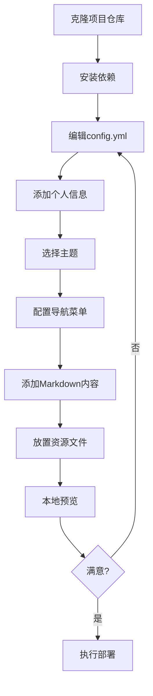

### 内容更新流程


---

## 关键技术实现要点

### YAML 配置解析

- 使用 YAML 解析库（如 js-yaml）读取配置文件
- 在构建时或运行时加载配置
- 提供配置校验确保必填项完整

### Markdown 渲染增强

- markdown-it 作为核心渲染引擎
- 集成代码高亮插件（highlight.js 或 Prism）
- 自定义渲染规则处理特殊语法
- 添加安全过滤防止 XSS 攻击

### CSS 变量主题系统

- 在根元素定义全局 CSS 变量
- 主题切换时通过 JavaScript 更新变量值
- 使用 localStorage 持久化用户选择
- 支持系统主题自动跟随（可选）

### PDF 在线预览

- 使用浏览器原生 iframe 嵌入 PDF
- 或集成 PDF.js 库提供更强大的预览功能
- 提供下载按钮作为备选方案

### 响应式实现

- 使用 CSS 媒体查询定义断点
- Flexbox / Grid 布局实现自适应
- 移动端优先的设计原则
- 触摸友好的交互元素尺寸

### 部署脚本

- Shell 脚本调用 npm 构建命令
- 使用 git 命令提交和推送产出
- 处理错误和异常情况
- 提供清晰的执行日志

### GitHub Actions 配置

- 定义触发条件（push、手动）
- 配置 Node.js 环境
- 执行构建和部署步骤
- 使用 GitHub Pages 部署 Action

---

## 非功能性需求

### 可用性
- 配置文件语法简单，非技术用户也能理解
- 提供详细的使用文档和示例
- 错误提示清晰友好

### 可维护性
- 代码结构清晰，职责分离
- 组件化设计，便于复用和修改
- 配置与代码分离，便于定制

### 兼容性
- 支持主流现代浏览器（Chrome、Firefox、Safari、Edge）
- 移动端浏览器兼容
- 不依赖后端，纯静态运行

### 性能
- 首屏加载时间 < 2秒（中等网络环境）
- 主题切换即时响应
- 页面交互流畅无卡顿

### 安全性
- Markdown 渲染过滤危险脚本
- 外部链接添加 rel="noopener noreferrer"
- 不收集用户隐私数据

---

## 项目交付物

### 代码交付物
- 完整的 React + Vite 项目源代码
- 配置文件模板和示例
- 部署脚本和 GitHub Actions 工作流
- 预设主题 CSS 文件

### 文档交付物
- 用户使用指南（如何配置和部署）
- 开发者文档（如何扩展和定制）
- 配置文件字段说明
- 主题定制指南

### 示例内容
- 示例配置文件
- 示例 Markdown 文章
- 示例资源文件（图片、PDF）

---

## 实施路线图

### 第一阶段：基础框架搭建
- 初始化 Vite + React 项目
- 搭建基本目录结构
- 实现配置文件解析
- 创建基础布局组件

### 第二阶段：核心功能开发
- 实现 Markdown 渲染引擎
- 开发主题系统和切换功能
- 实现响应式布局
- 创建路由和页面组件

### 第三阶段：增强功能开发
- PDF 预览功能
- 文件下载管理
- 代码高亮和 Markdown 增强
- 图片优化和懒加载

### 第四阶段：部署自动化
- 编写本地部署脚本
- 配置 GitHub Actions 工作流
- 测试部署流程
- 优化构建性能

### 第五阶段：主题和样式完善
- 开发多套预设主题
- 样式细节打磨
- 移动端适配优化
- 无障碍访问支持

### 第六阶段：文档和示例
- 编写用户文档
- 创建示例配置和内容
- 编写开发者文档
- 准备项目发布

---

## 风险与应对

| 风险项 | 影响 | 应对措施 |
|-------|------|---------|
| Markdown 渲染性能问题 | 大文档加载慢 | 实现渲染缓存、按需加载 |
| PDF 预览兼容性 | 部分浏览器不支持 | 提供下载降级方案 |
| GitHub Pages 限制 | 文件大小和流量限制 | 文档说明限制、建议资源优化 |
| 配置复杂度 | 用户学习成本高 | 提供详细示例和默认配置 |
| 主题定制难度 | 非开发者难以定制 | 提供可视化主题配置工具（未来） |

---

## 成功标准

### 功能完整性
- 所有核心功能按设计实现
- 配置驱动所有可定制内容
- 支持至少 3 种预设主题
- 部署流程完全自动化

### 用户体验
- 移动端和桌面端体验良好
- 主题切换无延迟
- Markdown 渲染准确美观
- 配置简单易懂

### 性能指标
- Lighthouse 性能评分 > 90
- 首屏加载时间 < 2 秒
- 构建时间 < 1 分钟

### 文档质量
- 用户文档清晰完整
- 示例可直接运行
- 常见问题有解答
