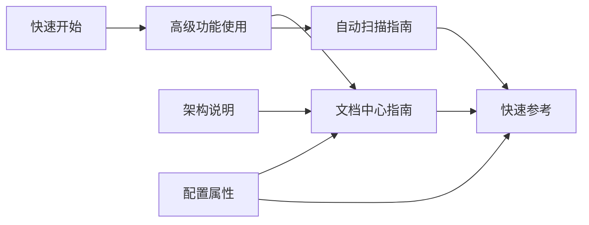

# 高级功能使用

探索系统的高级功能。

## 自动扫描

系统会自动扫描 content 目录下的所有文件夹...

## 智能排序

支持多种排序方式：
- 置顶（pinned/sticky）
- 优先级（priority）
- 顺序（order）
- 字母顺序

## 树形结构

通过 front matter 中的 `parent` 字段建立层级关系。

## 双向链接系统

系统支持强大的双向链接功能，帮助您建立文档之间的关联关系，创建知识网络。

### 什么是双向链接？

双向链接（Backlinks）是一种文档关联机制，允许您：
- **创建指向其他文档的链接**（对外链接/Outgoing Links）
- **自动显示引用当前文档的其他文档**（反向链接/Backlinks）
- **构建文档知识图谱**，展现文档间的关联关系

### 如何使用双向链接

#### 方法 1: 使用 relatedDocs 字段（推荐）

在文档的 front matter 中添加 `relatedDocs` 字段，显式声明关联的文档：

```yaml
---
title: 我的文档
id: my-document
relatedDocs: [quick-reference, document-center-guide, getting-started]
---
```

**优点：**
- 明确的关联关系
- 易于维护和管理
- 支持批量关联

#### 方法 2: 使用内容链接

在文档内容中直接引用其他文档，系统会自动识别：

```markdown
查看 [DocumentCenter 快速参考](#doc-quick-reference) 了解更多信息。

或者使用完整路径：
详细指南请参考 [文档中心架构](/content/pages/document-center-architecture.md)。
```

**链接格式：**
- `#doc-{文档ID}` - 使用文档 ID 引用
- `/content/{路径}.md` - 使用文件路径引用

#### 方法 3: 父子关系自动关联

使用 `parent` 字段建立的层级关系会自动在双向链接中体现：

```yaml
---
title: 子文档
id: child-doc
parent: parent-doc  # 会自动建立双向链接
---
```

### 链接类型说明

系统支持三种链接类型，用不同颜色标识：

| 类型 | 说明 | 颜色标识 |
|------|------|----------|
| 🔵 显式关联 | 通过 `relatedDocs` 声明的关联 | 蓝色 |
| 🟢 内容引用 | 文档内容中的链接引用 | 绿色 |
| 🟠 父子关系 | 通过 `parent` 建立的层级关系 | 橙色 |

### 双向链接面板

在每个文档底部，系统会自动显示双向链接面板，包含：

1. **链接到的文档** - 当前文档引用的其他文档
2. **被引用自** - 引用了当前文档的其他文档
3. **统计信息** - 总链接数和连接强度

### 使用场景示例

#### 场景 1: 系列教程文档

```yaml
---
title: React 基础教程
id: react-basics
relatedDocs: [react-advanced, react-hooks, react-router]
---

本文档是 React 系列教程的基础部分...
```

#### 场景 2: 参考文档网络

```yaml
---
title: API 参考
id: api-reference
relatedDocs: [authentication-guide, error-handling, rate-limits]
---
```

#### 场景 3: 知识库交叉引用

在内容中自然地引用其他文档：

```markdown
关于配置选项的详细说明，请参考 [配置文档](#doc-config-document-properties)。

部署相关问题，请查看 [部署故障排除](#doc-deploy-troubleshooting)。
```

### 最佳实践

1. **合理使用 relatedDocs**
   - 只关联真正相关的文档（3-5个为宜）
   - 保持双向关系的平衡
   - 定期更新和维护关联关系

2. **规范文档 ID**
   - 使用有意义的 ID（如 `getting-started` 而不是 `doc1`）
   - 保持 ID 的一致性和可读性
   - 避免频繁修改已建立关联的 ID

3. **内容链接策略**
   - 在合适的上下文中添加链接
   - 使用描述性的链接文本
   - 避免过度链接（保持内容可读性）

4. **构建知识图谱**
   - 建立主题文档作为中心节点
   - 创建索引文档串联相关内容
   - 定期检查和优化链接结构

### 引用关系可视化

以下是本文档系统中的引用关系示例：



**图表说明：**
- 节点代表文档
- 箭头表示引用关系（A → B 表示 A 引用了 B）
- 多个文档可以引用同一文档（如 D 被多个文档引用）

### 高级用法

#### 批量建立关联

对于需要建立大量关联的文档集合，可以创建一个索引文档：

```yaml
---
title: 教程索引
id: tutorial-index
relatedDocs: [
  getting-started,
  basic-concepts,
  advanced-features,
  best-practices,
  troubleshooting
]
---
```

#### 跨集合引用

不同 collection 之间的文档也可以建立链接：

```yaml
---
title: 部署指南（tutorials）
id: deployment-guide
collection: tutorials
relatedDocs: [deploy-troubleshooting, update-guide]  # 引用 deployment 集合的文档
---
```

### 注意事项

1. **文档 ID 必须存在** - 引用的文档 ID 必须在系统中存在，否则链接无效
2. **避免循环引用** - 虽然系统支持双向链接，但要避免无意义的循环引用
3. **性能考虑** - 大量文档时，反向链接构建可能需要一些时间
4. **链接格式** - 使用标准的 Markdown 链接格式，确保正确解析
