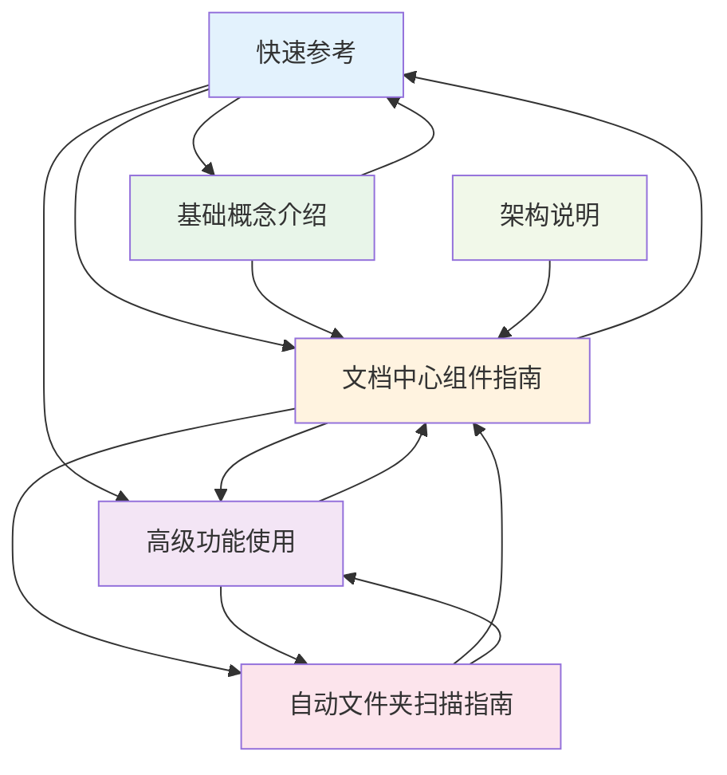
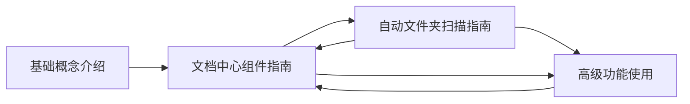
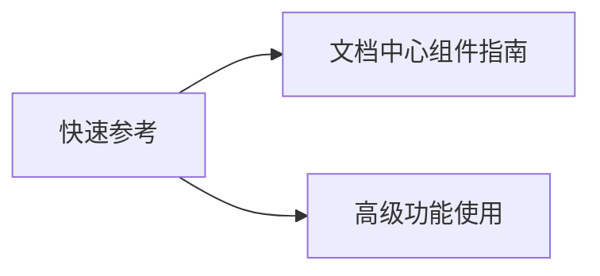
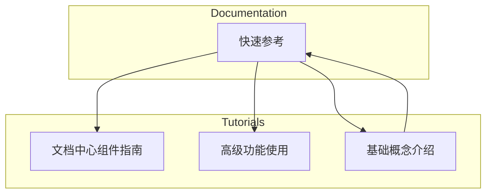

# 文档关系图谱

本文档展示系统中主要文档之间的引用关系和连接情况。

## 整体文档关系图

以下图表展示了教程系统中核心文档之间的双向链接关系：

## 图表说明

### 节点类型

- **蓝色节点** - 参考文档（Quick Reference）
- **橙色节点** - 核心指南（Guide）
- **紫色节点** - 高级功能（Advanced）
- **绿色节点** - 入门教程（Getting Started）
- **粉色节点** - 自动化功能（Automation）
- **浅绿节点** - 架构文档（Architecture）

### 连接关系

- **实线箭头** - 表示显式引用关系
- **箭头方向** - A → B 表示"文档 A 引用了文档 B"

## 核心文档中心

### 文档中心组件指南

作为系统的核心文档，[文档中心组件指南](#doc-document-center-guide) 被以下文档引用：

- [快速参考](#doc-quick-reference) - 提供 API 速查
- [高级功能使用](#doc-advanced-features) - 介绍高级特性
- [基础概念介绍](#doc-getting-started) - 入门教程
- [自动文件夹扫描指南](#doc-auto-folder-scan-guide) - 自动化功能

同时它也引用了：
- [快速参考](#doc-quick-reference)
- [高级功能使用](#doc-advanced-features)
- [自动文件夹扫描指南](#doc-auto-folder-scan-guide)

## 引用深度分析

### 引用最多的文档（被引用次数）

1. **文档中心组件指南** - 被 5 个文档引用
2. **快速参考** - 被 3 个文档引用
3. **高级功能使用** - 被 4 个文档引用

### 引用最广的文档（引用其他文档数量）

1. **文档中心组件指南** - 引用 3 个文档
2. **快速参考** - 引用 3 个文档
3. **基础概念介绍** - 引用 2 个文档

## 集合内的引用关系

### Tutorials 集合

### Documentation 集合

## 跨集合引用

系统支持跨集合的文档引用，建立了 `tutorials` 和 `documentation` 集合之间的连接：

## 知识图谱特性

### 强连接节点

强连接节点是指同时拥有大量入站链接和出站链接的文档：

- **文档中心组件指南** - 5 入站, 3 出站（总计 8 个连接）
- **高级功能使用** - 4 入站, 2 出站（总计 6 个连接）

### 入口节点

适合作为学习起点的文档：

- **基础概念介绍** - 新手入门推荐
- **快速参考** - 快速查询推荐

### 索引节点

作为知识索引的中心文档：

- **文档中心组件指南** - 核心知识中心
- **高级功能使用** - 高级特性索引

## 如何使用双向链接

### 查看文档链接

在每个文档底部，您会看到**双向链接面板**，包含：

1. **链接到的文档** (→) - 当前文档引用的其他文档
2. **被引用自** (←) - 引用了当前文档的其他文档

### 链接类型标识

- 🔵 **显式关联** - 通过 `relatedDocs` 字段声明
- 🟢 **内容引用** - 文档正文中的链接
- 🟠 **父子关系** - 通过 `parent` 字段建立

### 导航建议

1. **从入口节点开始** - 选择适合您经验水平的入口文档
2. **跟随链接探索** - 点击双向链接面板中的链接
3. **关注强连接节点** - 这些是核心知识点
4. **利用反向链接** - 发现意想不到的相关内容

## 文档网络统计

### 总体数据

- **文档总数**: 6 个核心文档
- **链接总数**: 18 个双向链接
- **平均连接度**: 3 个连接/文档
- **最大深度**: 3 跳可达任意文档

### 集合分布

| 集合 | 文档数 | 内部链接 | 跨集合链接 |
|------|--------|----------|------------|
| tutorials | 4 | 8 | 6 |
| documentation | 2 | 2 | 6 |

## 维护建议

### 添加新文档时

1. 至少链接到 1-2 个相关现有文档
2. 在相关文档中添加反向链接
3. 确保新文档可从入口节点访问

### 优化链接结构

1. 定期检查孤立文档（无链接的文档）
2. 避免过度链接（保持 3-5 个链接为宜）
3. 保持双向链接的对称性
4. 建立明确的学习路径

## 相关资源

要深入了解双向链接系统，请查看：

- [高级功能使用](#doc-advanced-features) - 双向链接完整指南
- [文档中心组件指南](#doc-document-center-guide) - 了解基础架构
- [快速参考](#doc-quick-reference) - 快速查询 API

---

> 💡 **提示**: 本图谱会随着文档的添加和更新自动反映最新的关系状态。双向链接面板实时展示文档间的连接。
